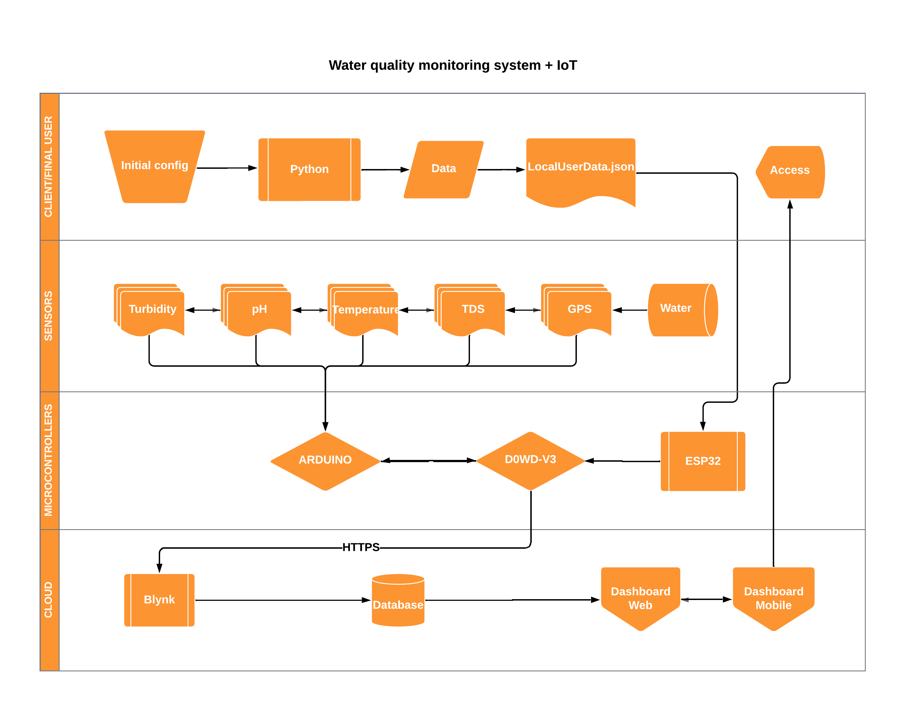

# Water-Quality-Monitoring-System

> A system for detecting and monitoring contamination in water reservoirs. Developed using an `ESP32` microcontroller, measuring sensors and `C++`.

 

# Table of contents

- [Why?](#why)
- [System design](#system-design)
- [Installation](#installation)
- [Recommended configurations](#recommended-configurations)
- [Custom configurations](#custom-configurations)
- [Release history](#release-history)
- [Contributing](#contributing)
- [License](#license)

# Why?

The project views viabilizing the process of monitoring water quality in any given reservatory, contributing for the determination of ambiental factors that affect water, being capable of detecting toxic chemicals, like heavy metals (mercury being one of them) on the given reservatory it helps preventing health problems and ambiental impact via irregular dump.

Proposing a new and simple solution to individual or comercial applications.

The initial motivation was given in one of [Alexandre Guassi's](https://www.linkedin.com/in/alexandre-guassi-4008a3168/?trk=public_profile_browsemap&originalSubdomain=br) class in Faculty of Engineering of Sorocaba (FACENS), when seeing the situation of riverside communities at Baixo Tapajós, more details [here](https://www.wwf.org.br/?81968/Moradores-de-areas-urbanas-e-ribeirinhas-do-Baixo-Tapajos-tem-altas-taxas-de-exposicao-por-mercurio#:~:text=De%20acordo%20com%20o%20estudo,foi%20registrado%20na%20%C3%A1rea%20ribeirinha.).

# System design

[(Back to top)](#table-of-contents)

# Installation

[(Back to top)](#table-of-contents)

# Recommended configurations

[(Back to top)](#table-of-contents)

# Custom configurations

[(Back to top)](#table-of-contents)

# Release history
* 0.0.1
    * First prototype test
    * Testing the ESP32
    * Project viability test
* 0.0.2
    * First working version with Temp+TDS
    * DS18B20 + TDS Meter V1.0
    * Fixed bugs and erros in arduino-esp32 communication
    * Fixed data-decoding on esp32's side

# Contributing

[(Back to top)](#table-of-contents)

Your contributions are always welcome!

# License

[(Back to top)](#table-of-contents)

The MIT License (MIT) 2024 - [Pedro Salviano](https://github.com/P-py). Please have a look at the [LICENSE.md](LICENSE.md) for more details.
